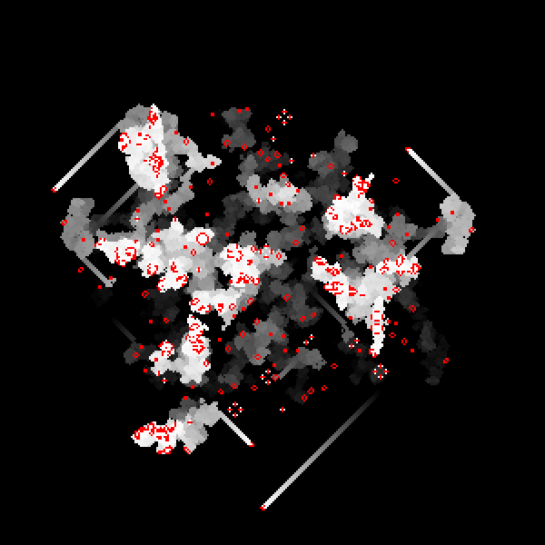
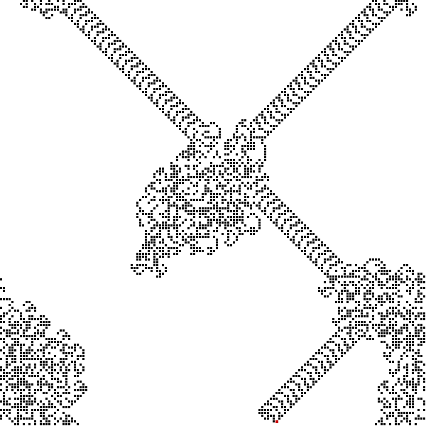
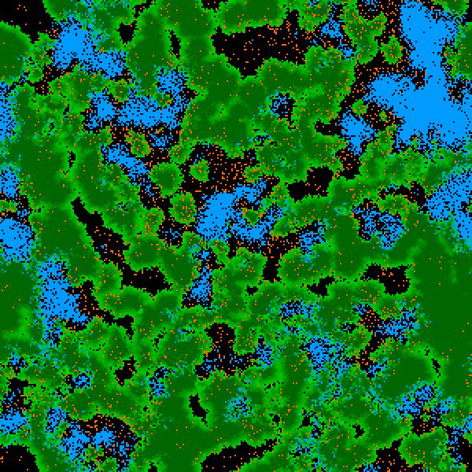
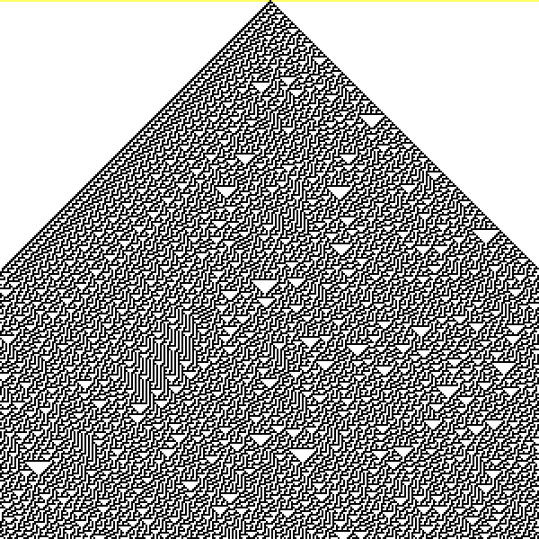

## CASE - Cellular Automata Simulation Engine

CASE is a header only library made for helping run CA-like simulations.
The engine strives to achieve good performance mainly by using the 
following strategies:

* Concurreny. In the classical CA style simulator, all processor cores are used
to distribute automaton update and rendering every frame. 
* Compile-time optimization. The coding style tries to leverage compiler
optimization as much as possible by using templates and a simple procedural
programming style.
* Cache locality. CASE heavily encourages using one heterogenous agent type,
which makes it possible to store all agents linearly in memory. CASE then
provides tools to make it convenient to access agents neighbours, and to
access any agent as if it was living in the 2d-plane we imagine logically.

Note: CASE makes a distinction between two types of CA:

* Static: This is the classic style of CA, where every cell in the world is
an automaton which updates according to its rules every frame. Demo examples:
Conway's Life, Wolframs rules, etc.
* Dynamic: A more general simulation style, where agents can be created,
destroyed, and can move around in the world. Demo examples: Foxes And Rabbits,
Langton's ant.

# License

Public domain. My intent is that any code or ideas you find here are 
truly and fully yours for any purpose in perpetuity.

# Dependencies

C++14
[SFML](https://github.com/SFML/SFML)

# Installation

1. Clone or download this repo.
2. Run `sudo make install` or `sudo make demo` or just `sudo make`

# Demos

The examples found in the demo folder are intended to show how various
CA styles can be simulated using the CASE library. 

Conways Life

Langtons Ant

Foxes And Rabbits

Wolframs rules

